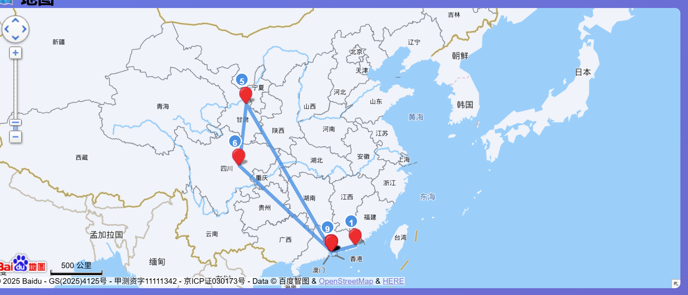
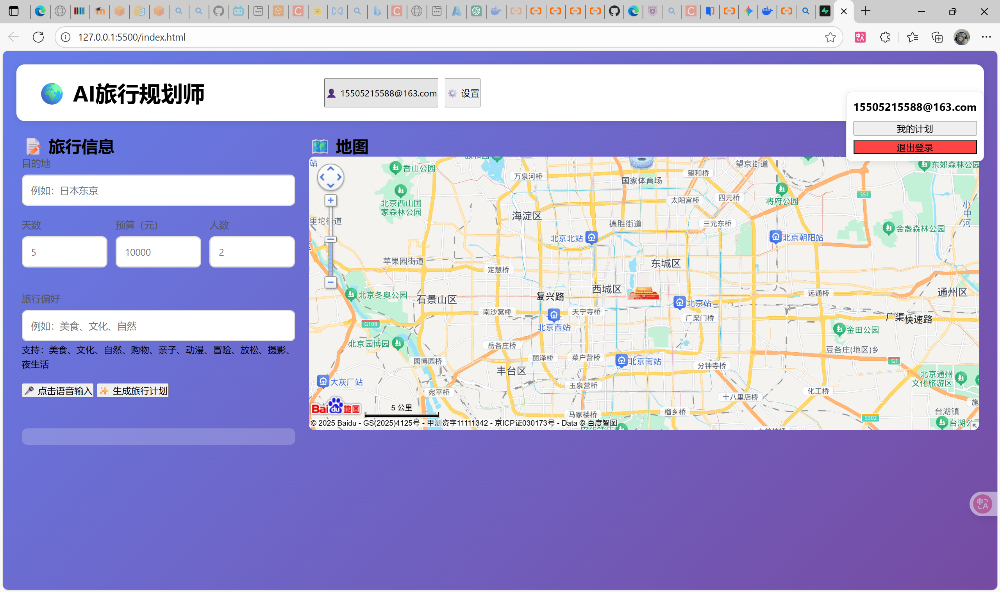
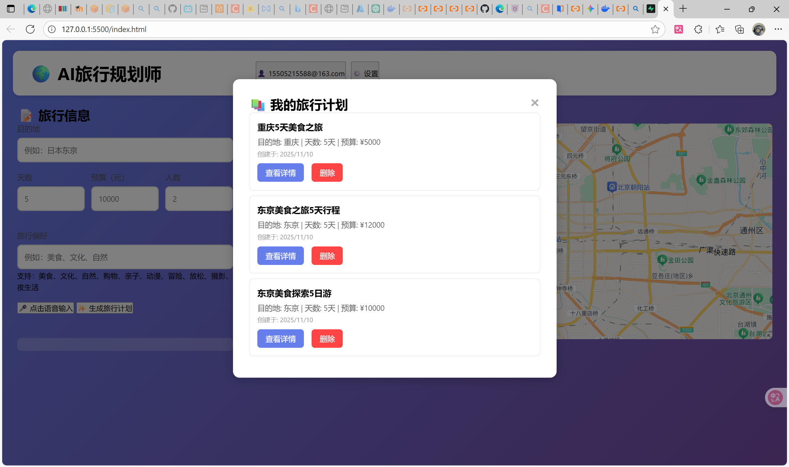

# 🌍 AI旅行规划师 (ai-traveller)


这是一个基于AI的智能旅行规划系统，旨在为用户提供个性化、详细的旅行方案。

本项目通过一个自包含的 Docker 镜像进行部署，该镜像集成了前端用户界面和 Node.js 后端代理服务。


## ✨ 主要功能


- **✨ AI 智能规划**: 对接阿里云通义千问，根据用户需求（目的地、天数、预算、偏好等）一键生成包含每日行程、住宿、餐饮和交通的详细计划。
- **🎤 语音智能填表**: 支持语音输入，系统可自动识别并填充表单中的目的地、天数、预算等关键信息。
- **🗺️ 交互式地图**: (需配置Key) 集成百度地图，可在地图上实时显示目的地，并在生成计划后绘制旅行路线。
- **☁️ 云端保存**: (需配置Key) 支持使用 Supabase 进行用户注册和登录，并将生成的旅行计划保存到云端。


## 🛠️ 技术栈


- **前端**: HTML, CSS, JavaScript
- **后端**: Node.js, Express 
- **AI 服务**: 阿里云通义千问 (DashScope)
- **地图服务**: 百度地图
- **数据库/认证**: Supabase
- **部署**: Docker


## 🚀 快速启动 (推荐方式)

该镜像仓库已设为**公开**，**无需登录 (`docker login`)** 即可直接拉取和运行。

> **💡 特别提醒:**
>
> 本镜像仓库已设为公开，并已在本地测试可直接拉取 (pull) 和运行。
>
> **以防万一**：如果拉取时遇到任何权限问题，请使用教学平台提交的PDF文件中的 `USERNAME` 和 `PASSWORD`，先执行 `docker login crpi-ub2y20943keg03nc.cn-hangzhou.personal.cr.aliyuncs.com` 登录，然后再 `pull` 镜像。


### 1. 拉取 Docker 镜像


Bash

```
docker pull crpi-ub2y20943keg03nc.cn-hangzhou.personal.cr.aliyuncs.com/homework11/ai-traveller:latest
```


### 2. 运行 Docker 容器


此命令将在后台启动容器，并将本机的3000端口映射到容器的3000端口。

Bash

```
docker run -d -p 3000:3000 --name ai-traveller-app crpi-ub2y20943keg03nc.cn-hangzhou.personal.cr.aliyuncs.com/homework11/ai-traveller:latest
```

*(注意: 如果你之前运行过，提示 `ai-traveller-app` 名称冲突，请先执行 `docker rm -f ai-traveller-app`)*


### 3. 访问应用


一切就绪！打开浏览器并访问：

http://localhost:3000


## ⚙️ 应用配置


**重要提示：** 应用启动后，必须配置 API Key 才能使用核心功能。

1. 在打开的网页 (`http://localhost:3000`) 右上角，点击 **"⚙️ 设置"** 按钮。
2. **（必需）** 在 **"阿里云通义千问 API Key"** 处填写您的 Key。这是AI生成功能的核心。
3. **（可选）** 填写 **"百度地图 API Key"** 以启用地图显示和路线规划功能。
4. **（可选）** 填写 **"Supabase URL"** 和 **"Supabase Anon Key"** 以启用用户登录和云端保存功能。其中注册后需要进行**邮箱验证**才能登陆。
5. 点击 "保存设置"，即可开始使用。

## 📸 项目截图

*(截图文件已存放于 `screenshots/` 目录下)*

部分使用截图：（已配置百度地图API和Supabase数据库）






## 🛑 如何停止


如果需要停止在后台运行的容器，执行以下命令：

Bash

```
docker stop ai-traveller-app
```

(如果需要彻底移除容器，再执行 `docker rm ai-traveller-app`)
